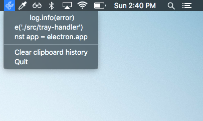

    

<h1 align="center">clippy</h1>

  <strong>Nifty little clipboard manager build with Electron</strong>

 

  
  <a href="https://github.com/prettier/prettier">
    
     
  </a>
  
  

 

    

<h2>Table of Contents</h2>

  
Table of Contents

  <li><a href="#contribute">Contribute</a></li>
  <li><a href="#license">License</a></li>

## Contributing

Contributions are welcome!

1. Fork it.
2. Create your feature branch: `git checkout -b my-new-feature`
3. Commit your changes: `git commit -am 'Add some feature'`
4. Push to the branch: `git push origin my-new-feature`
5. Submit a pull request :D

Or open up [a issue](https://github.com/tiaanduplessis/clippy/issues).

## License

Licensed under the MIT License.
